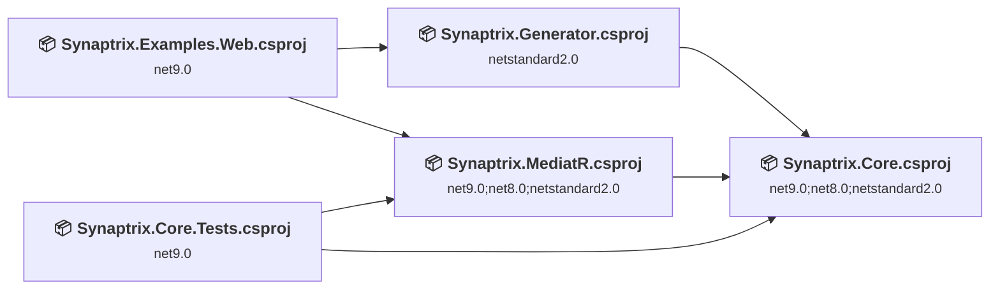
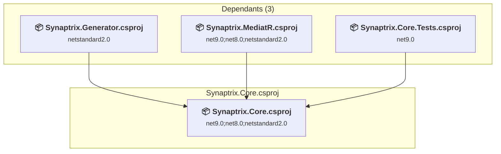
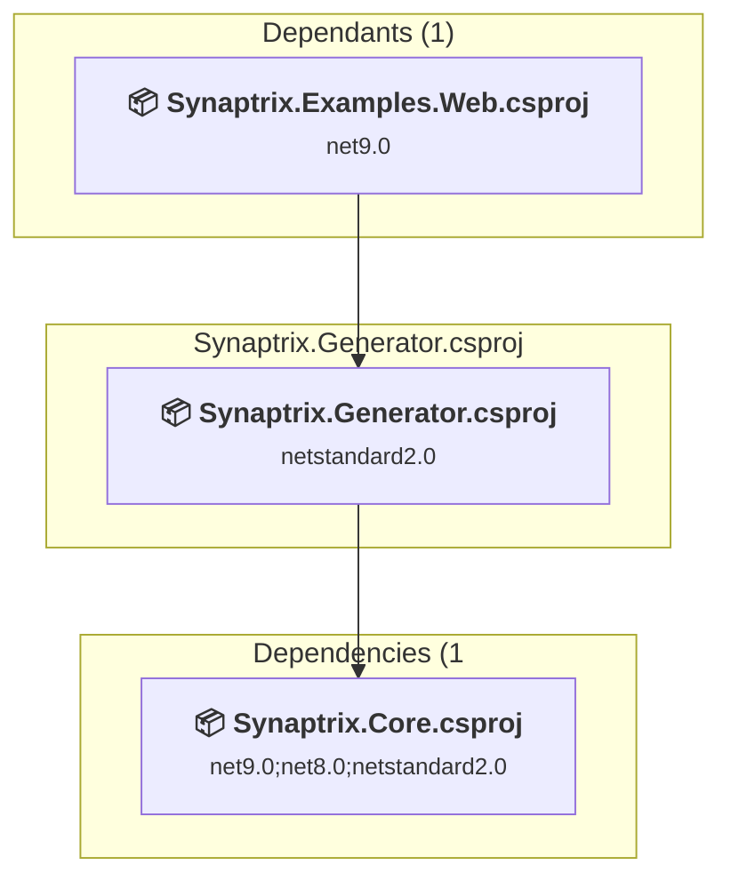
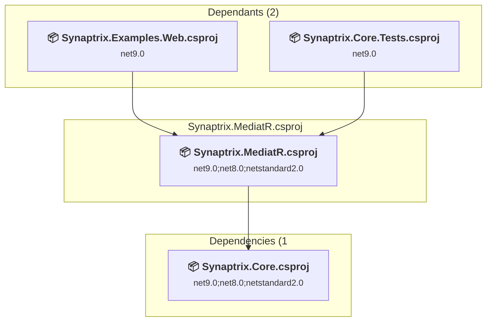
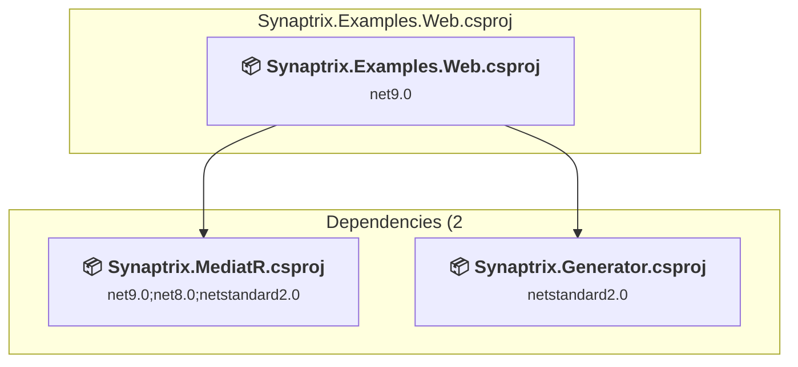
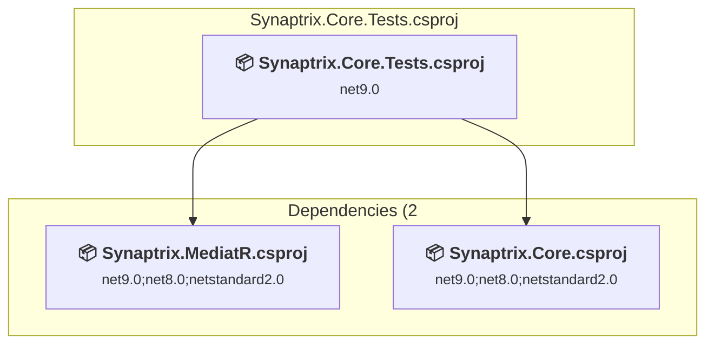

# Projects and dependencies analysis

This document provides a comprehensive overview of the projects and their dependencies in the context of upgrading to .NETCoreApp,Version=v10.0.

## Table of Contents

- [Executive Summary](#executive-Summary)
  - [Highlevel Metrics](#highlevel-metrics)
  - [Projects Compatibility](#projects-compatibility)
  - [Package Compatibility](#package-compatibility)
  - [API Compatibility](#api-compatibility)
- [Aggregate NuGet packages details](#aggregate-nuget-packages-details)
- [Top API Migration Challenges](#top-api-migration-challenges)
  - [Technologies and Features](#technologies-and-features)
  - [Most Frequent API Issues](#most-frequent-api-issues)
- [Projects Relationship Graph](#projects-relationship-graph)
- [Project Details](#project-details)

  - [Synaptrix.Core\Synaptrix.Core.csproj](#concordiacoreconcordiacorecsproj)
  - [Synaptrix.Generator\Synaptrix.Generator.csproj](#concordiageneratorconcordiageneratorcsproj)
  - [Synaptrix.MediatR\Synaptrix.MediatR.csproj](#concordiamediatrconcordiamediatrcsproj)
  - [examples\Synaptrix.Examples.Web\Synaptrix.Examples.Web.csproj](#examplesconcordiaexampleswebconcordiaexampleswebcsproj)
  - [tests\Synaptrix.Core.Tests\Synaptrix.Core.Tests.csproj](#testsconcordiacoretestsconcordiacoretestscsproj)

## Executive Summary

### Highlevel Metrics

| Metric | Count | Status |
| :--- | :---: | :--- |
| Total Projects | 5 | 4 require upgrade |
| Total NuGet Packages | 12 | 4 need upgrade |
| Total Code Files | 30 |  |
| Total Code Files with Incidents | 5 |  |
| Total Lines of Code | 3773 |  |
| Total Number of Issues | 12 |  |
| Estimated LOC to modify | 3+ | at least 0,1% of codebase |

### Projects Compatibility

| Project | Target Framework | Difficulty | Package Issues | API Issues | Est. LOC Impact | Description |
| :--- | :---: | :---: | :---: | :---: | :---: | :--- |
| [Synaptrix.Core\Synaptrix.Core.csproj](#concordiacoreconcordiacorecsproj) | net9.0;net8.0;netstandard2.0 | 🟢 Low | 2 | 0 |  | ClassLibrary, Sdk Style = True |
| [Synaptrix.Generator\Synaptrix.Generator.csproj](#concordiageneratorconcordiageneratorcsproj) | netstandard2.0 | ✅ None | 0 | 0 |  | ClassLibrary, Sdk Style = True |
| [Synaptrix.MediatR\Synaptrix.MediatR.csproj](#concordiamediatrconcordiamediatrcsproj) | net9.0;net8.0;netstandard2.0 | 🟢 Low | 1 | 0 |  | ClassLibrary, Sdk Style = True |
| [examples\Synaptrix.Examples.Web\Synaptrix.Examples.Web.csproj](#examplesconcordiaexampleswebconcordiaexampleswebcsproj) | net9.0 | 🟢 Low | 1 | 3 | 3+ | AspNetCore, Sdk Style = True |
| [tests\Synaptrix.Core.Tests\Synaptrix.Core.Tests.csproj](#testsconcordiacoretestsconcordiacoretestscsproj) | net9.0 | 🟢 Low | 1 | 0 |  | DotNetCoreApp, Sdk Style = True |

### Package Compatibility

| Status | Count | Percentage |
| :--- | :---: | :---: |
| ✅ Compatible | 8 | 66,7% |
| ⚠️ Incompatible | 0 | 0,0% |
| 🔄 Upgrade Recommended | 4 | 33,3% |
| ***Total NuGet Packages*** | ***12*** | ***100%*** |

### API Compatibility

| Category | Count | Impact |
| :--- | :---: | :--- |
| 🔴 Binary Incompatible | 0 | High - Require code changes |
| 🟡 Source Incompatible | 0 | Medium - Needs re-compilation and potential conflicting API error fixing |
| 🔵 Behavioral change | 3 | Low - Behavioral changes that may require testing at runtime |
| ✅ Compatible | 2715 |  |
| ***Total APIs Analyzed*** | ***2718*** |  |

## Aggregate NuGet packages details

| Package | Current Version | Suggested Version | Projects | Description |
| :--- | :---: | :---: | :--- | :--- |
| coverlet.collector | 6.0.4 |  | [Synaptrix.Core.Tests.csproj](#testsconcordiacoretestsconcordiacoretestscsproj) | ✅Compatible |
| Microsoft.AspNetCore.OpenApi | 9.0.8 | 10.0.1 | [Synaptrix.Examples.Web.csproj](#examplesconcordiaexampleswebconcordiaexampleswebcsproj) | È consigliabile eseguire l'aggiornamento del pacchetto NuGet |
| Microsoft.CodeAnalysis.Analyzers | 3.3.4 |  | [Synaptrix.Generator.csproj](#concordiageneratorconcordiageneratorcsproj) | ✅Compatible |
| Microsoft.CodeAnalysis.CSharp | 4.9.2 |  | [Synaptrix.Generator.csproj](#concordiageneratorconcordiageneratorcsproj) | ✅Compatible |
| Microsoft.Extensions.DependencyInjection | 9.0.8 | 10.0.1 | [Synaptrix.Core.Tests.csproj](#testsconcordiacoretestsconcordiacoretestscsproj) | È consigliabile eseguire l'aggiornamento del pacchetto NuGet |
| Microsoft.Extensions.DependencyInjection.Abstractions | 9.0.8 | 10.0.1 | [Synaptrix.Core.csproj](#concordiacoreconcordiacorecsproj) [Synaptrix.MediatR.csproj](#concordiamediatrconcordiamediatrcsproj) | È consigliabile eseguire l'aggiornamento del pacchetto NuGet |
| Microsoft.Extensions.Logging.Abstractions | 9.0.8 | 10.0.1 | [Synaptrix.Core.csproj](#concordiacoreconcordiacorecsproj) | È consigliabile eseguire l'aggiornamento del pacchetto NuGet |
| Microsoft.NET.Test.Sdk | 17.14.1 |  | [Synaptrix.Core.Tests.csproj](#testsconcordiacoretestsconcordiacoretestscsproj) | ✅Compatible |
| NETStandard.Library | 2.0.3 |  | [Synaptrix.Generator.csproj](#concordiageneratorconcordiageneratorcsproj) | ✅Compatible |
| Swashbuckle.AspNetCore | 9.0.4 |  | [Synaptrix.Examples.Web.csproj](#examplesconcordiaexampleswebconcordiaexampleswebcsproj) | ✅Compatible |
| xunit | 2.9.3 |  | [Synaptrix.Core.Tests.csproj](#testsconcordiacoretestsconcordiacoretestscsproj) | ✅Compatible |
| xunit.runner.visualstudio | 3.1.4 |  | [Synaptrix.Core.Tests.csproj](#testsconcordiacoretestsconcordiacoretestscsproj) | ✅Compatible |

## Top API Migration Challenges

### Technologies and Features

| Technology | Issues | Percentage | Migration Path |
| :--- | :---: | :---: | :--- |

### Most Frequent API Issues

| API | Count | Percentage | Category |
| :--- | :---: | :---: | :--- |
| T:System.Uri | 2 | 66,7% | Behavioral Change |
| M:System.Uri.#ctor(System.String) | 1 | 33,3% | Behavioral Change |

## Projects Relationship Graph

Legend:
📦 SDK-style project
⚙️ Classic project

## Project Details

### Synaptrix.Core\Synaptrix.Core.csproj

#### Project Info

- **Current Target Framework:** net9.0;net8.0;netstandard2.0
- **Proposed Target Framework:** net9.0;net8.0;netstandard2.0;net10.0
- **SDK-style**: True
- **Project Kind:** ClassLibrary
- **Dependencies**: 0
- **Dependants**: 3
- **Number of Files**: 21
- **Number of Files with Incidents**: 1
- **Lines of Code**: 959
- **Estimated LOC to modify**: 0+ (at least 0,0% of the project)

#### Dependency Graph

Legend:
📦 SDK-style project
⚙️ Classic project

### API Compatibility

| Category | Count | Impact |
| :--- | :---: | :--- |
| 🔴 Binary Incompatible | 0 | High - Require code changes |
| 🟡 Source Incompatible | 0 | Medium - Needs re-compilation and potential conflicting API error fixing |
| 🔵 Behavioral change | 0 | Low - Behavioral changes that may require testing at runtime |
| ✅ Compatible | 558 |  |
| ***Total APIs Analyzed*** | ***558*** |  |

### Synaptrix.Generator\Synaptrix.Generator.csproj

#### Project Info

- **Current Target Framework:** netstandard2.0✅
- **SDK-style**: True
- **Project Kind:** ClassLibrary
- **Dependencies**: 1
- **Dependants**: 1
- **Number of Files**: 3
- **Lines of Code**: 231
- **Estimated LOC to modify**: 0+ (at least 0,0% of the project)

#### Dependency Graph

Legend:
📦 SDK-style project
⚙️ Classic project

### API Compatibility

| Category | Count | Impact |
| :--- | :---: | :--- |
| 🔴 Binary Incompatible | 0 | High - Require code changes |
| 🟡 Source Incompatible | 0 | Medium - Needs re-compilation and potential conflicting API error fixing |
| 🔵 Behavioral change | 0 | Low - Behavioral changes that may require testing at runtime |
| ✅ Compatible | 254 |  |
| ***Total APIs Analyzed*** | ***254*** |  |

### Synaptrix.MediatR\Synaptrix.MediatR.csproj

#### Project Info

- **Current Target Framework:** net9.0;net8.0;netstandard2.0
- **Proposed Target Framework:** net9.0;net8.0;netstandard2.0;net10.0
- **SDK-style**: True
- **Project Kind:** ClassLibrary
- **Dependencies**: 1
- **Dependants**: 2
- **Number of Files**: 2
- **Number of Files with Incidents**: 1
- **Lines of Code**: 896
- **Estimated LOC to modify**: 0+ (at least 0,0% of the project)

#### Dependency Graph

Legend:
📦 SDK-style project
⚙️ Classic project

### API Compatibility

| Category | Count | Impact |
| :--- | :---: | :--- |
| 🔴 Binary Incompatible | 0 | High - Require code changes |
| 🟡 Source Incompatible | 0 | Medium - Needs re-compilation and potential conflicting API error fixing |
| 🔵 Behavioral change | 0 | Low - Behavioral changes that may require testing at runtime |
| ✅ Compatible | 777 |  |
| ***Total APIs Analyzed*** | ***777*** |  |

### examples\Synaptrix.Examples.Web\Synaptrix.Examples.Web.csproj

#### Project Info

- **Current Target Framework:** net9.0
- **Proposed Target Framework:** net10.0
- **SDK-style**: True
- **Project Kind:** AspNetCore
- **Dependencies**: 2
- **Dependants**: 0
- **Number of Files**: 3
- **Number of Files with Incidents**: 2
- **Lines of Code**: 314
- **Estimated LOC to modify**: 3+ (at least 1,0% of the project)

#### Dependency Graph

Legend:
📦 SDK-style project
⚙️ Classic project

### API Compatibility

| Category | Count | Impact |
| :--- | :---: | :--- |
| 🔴 Binary Incompatible | 0 | High - Require code changes |
| 🟡 Source Incompatible | 0 | Medium - Needs re-compilation and potential conflicting API error fixing |
| 🔵 Behavioral change | 3 | Low - Behavioral changes that may require testing at runtime |
| ✅ Compatible | 254 |  |
| ***Total APIs Analyzed*** | ***257*** |  |

### tests\Synaptrix.Core.Tests\Synaptrix.Core.Tests.csproj

#### Project Info

- **Current Target Framework:** net9.0
- **Proposed Target Framework:** net10.0
- **SDK-style**: True
- **Project Kind:** DotNetCoreApp
- **Dependencies**: 2
- **Dependants**: 0
- **Number of Files**: 5
- **Number of Files with Incidents**: 1
- **Lines of Code**: 1373
- **Estimated LOC to modify**: 0+ (at least 0,0% of the project)

#### Dependency Graph

Legend:
📦 SDK-style project
⚙️ Classic project

### API Compatibility

| Category | Count | Impact |
| :--- | :---: | :--- |
| 🔴 Binary Incompatible | 0 | High - Require code changes |
| 🟡 Source Incompatible | 0 | Medium - Needs re-compilation and potential conflicting API error fixing |
| 🔵 Behavioral change | 0 | Low - Behavioral changes that may require testing at runtime |
| ✅ Compatible | 872 |  |
| ***Total APIs Analyzed*** | ***872*** |  |

